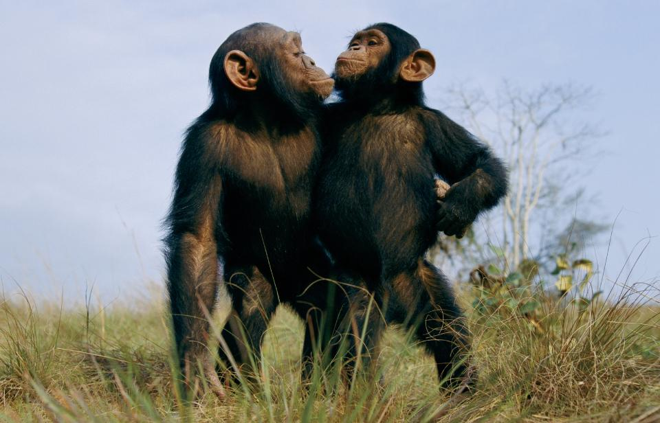
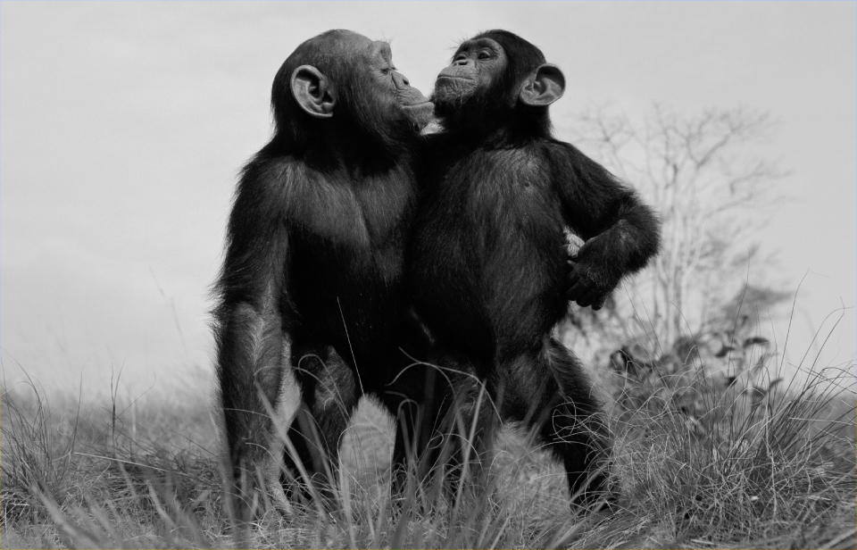
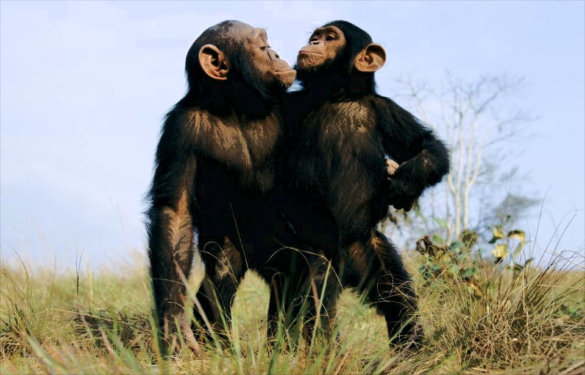
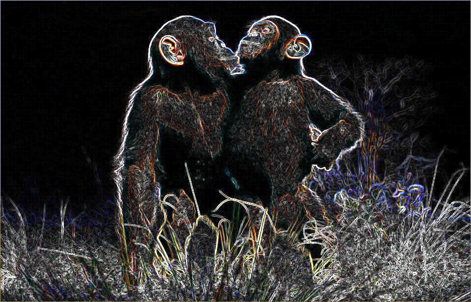
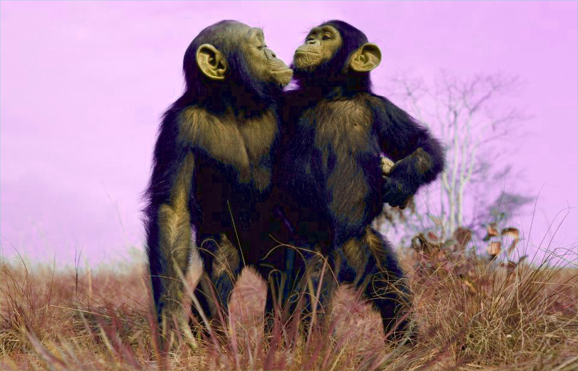

## Description
This program applies different filters to an image when the keys 0 through 5 are pressed. When 0 is pressed, the image reverts back to its original state. When 1 is pressed, the Grayscale filter is applied to the image. When 2 is pressed, the Constrast filter is applied to the image. When 3 is pressed, the Gaussian Blur filter is applied to the image. When 4 is pressed, the Edge Detection filter is applied to the image. Finally, when 5 is 
pressed my own personal filter that I created is applied to the image. 

I created a copy of the image and this is the one that is modified when the filter functions are called. Each function traverses the pixels of the original image, but the changes are applied to the copy. The functions that make use of a kernel are myEdge and myGaussianBlur. All functions take in the parameters img and copy, but the functions that apply the kernels also take in the corresponding kernels defined at the beginning. 

### 0 - No Filter

For each pixel, the noFilter function finds the rgb values of the original image and applies those rgb values to the copy. 

### 1 - Grayscale

The myGrayscale function finds the rgb values of each pixel in the original image, averages them, and then applies the corresponding color using this average to the copy. 

### 2 - Contrast

The myContrast function changes the colorMode to HSB. Then for each pixel, the brightness from the original image is compared to a threshold 
value. If the brightness is below the threshold value, then brightness is added and this new value is applied to the pixels in the copy. If the brightness in the original is below the threshold value, then brightness is subtracted and the value is applied to the pixels in the copy. 

### 3 - Gaussian Blur

The myGaussianBlur function applies the kernel values and stores the new value. This new rgb value is applied to the copy. 

### 4 - Edge Detection

myEdge creates 2 red variables, 2 green variables, and 2 blue variables for each pixel. This is because there are two kernel values that need to be applied. Once the kernel values are applied, to find the rgb values that will be used the magnitude is found. This is done by taking the square root of the sum of the squared values for each color. Then these new rgb values are applied to the pixels in the copy. 

### 5 - My Filter 

For each pixel, the myFilter function compares the hue of the pixel in the original image to a threshold value. If the hue is below the threshold value, the hue is reduced by 50 and brightness is increased by 10. If the hue is above the threshold value, the hue is increased by 50, brightness is increased by 20 and saturation is increased by 15. 

## Requirements
- Processing

## How to Use
Open the .pde file and click 'Run.' The original image will automatically display when this happens.
Press the keys 0-5 to apply different filters. The filters and corresponding keys are listed below.
- 0 - No Filter: Displays the original image.
- 1 - Grayscale
- 2 - Contrast
- 3 - Gaussian Blur
- 4 - Edge Detection
- 5 - Personal Filter